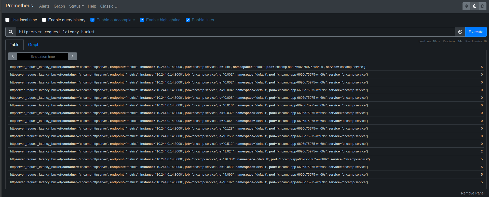
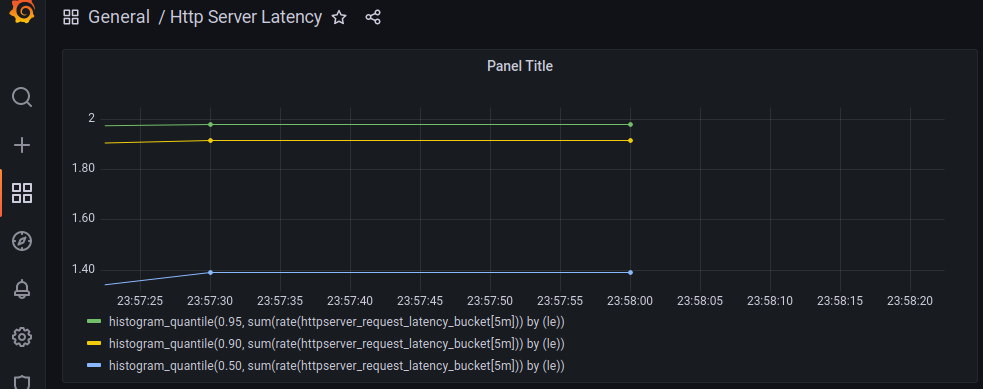

# Homework 10
1. 为 HTTPServer 添加 0-2 秒的随机延时 [v]
2. 为 HTTPServer 项目添加延时 Metric   [v]
3. 将 HTTPServer 部署至测试集群，并完成 Prometheus 配置 [v]
4. 从 Promethus 界面中查询延时指标数据 [v]
5. 可选）创建一个 Grafana Dashboard 展现延时分配情况 [v]





## How to deploy
```shell
make kind-up(when use kind)
make docker-build
make kind-load
make apply
make prometheus-install
```

## Send request
```shell
// endpoint: localhost
make test-response
```
### Open prometheus and grafana in browser
`kubectl port-forward service/prom-stack-kube-prometheus-prometheus 3001:9090`
`kubectl port-forward service/prom-stack-grafana 3000:80`

## referenece
### Deploy prometheus and grafana by kube-prometheus-stack
https://github.com/prometheus-community/helm-charts/tree/main/charts/kube-prometheus-stack

### servive monitor configuration
`k8s/servicemonitoring.yaml` (included in `make apply`)

### import grafana dashboard 
`./grafana-dashboard/dashboard.json`
